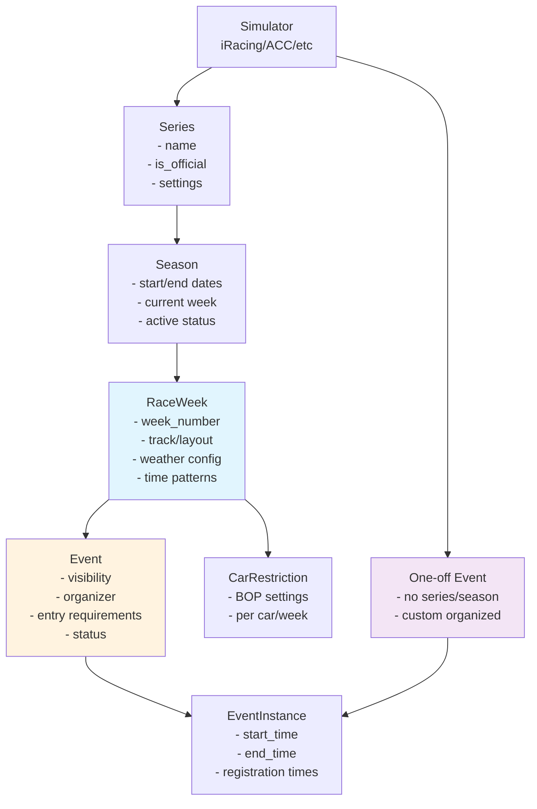
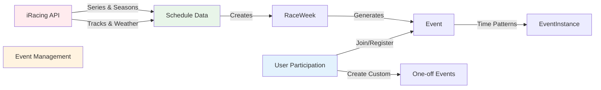

# Sim App Data Model Analysis

## Executive Summary

This document analyzes the current data model for the sim app, specifically examining the relationship between `Series`, `Season`, `RaceWeek`, `Event`, and `EventInstance` models. The analysis addresses the proposal to merge `RaceWeek` and `Event` models and rename `EventInstance` to `TimeSlot`.

**Key Finding**: While there is some duplication between `RaceWeek` and `Event`, they serve distinct purposes. The separation provides important flexibility but could benefit from clearer naming and reduced duplication.

## Current Model Structure

### Model Hierarchy
```
Simulator
    ↓
Series (e.g., "Formula Sprint")
    ↓
Season (e.g., "2024 Season 1")
    ↓
RaceWeek (e.g., "Week 3 at Spa")
    ↓
Event (actual participatable event)
    ↓
EventInstance (specific time slots)
```

### Visual Model Relationships



### Data Flow from APIs



### Model Purposes

#### 1. Series
- Represents a racing championship or series
- Examples: "Formula Sprint", "GT3 Fixed", "Radical SR10 Cup"
- Contains series-wide settings and rules

#### 2. Season
- A specific season within a series
- Tracks dates, active status, and season-specific settings
- Has a defined schedule of weeks

#### 3. RaceWeek
- Represents a scheduled week in the official series calendar
- **Primary purpose**: Store the "official schedule" from simulator APIs
- Contains:
  - Week number and dates
  - Track/layout assignment
  - Weather configuration
  - Time patterns for recurring races
  - Track-specific settings

#### 4. Event
- Represents an actual event that users can participate in
- **Primary purpose**: Add participation and organization features
- Can be:
  - Linked to a RaceWeek (official series event)
  - Standalone (user/club organized)
- Contains:
  - Visibility and access control
  - Entry requirements
  - Organizer information
  - Registration settings

#### 5. EventInstance
- Specific time slots when an event runs
- Contains actual start/end times
- Can be predicted (from patterns) or matched to actual races

## Analysis of Duplication

### Overlapping Fields

Both `RaceWeek` and `Event` contain:
1. **Track/Layout Reference**
   - RaceWeek: `sim_layout` (FK)
   - Event: `sim_layout` (FK)

2. **Date/Time Information**
   - RaceWeek: `start_date`, `end_date`
   - Event: `event_date`

3. **Weather Configuration**
   - RaceWeek: `weather_config`, `weather_forecast_url`
   - Event: `weather` (JSONField)

4. **Car/Class Restrictions**
   - RaceWeek: Via `CarRestriction` model
   - Event: `allowed_car_class_ids`

### Distinct Responsibilities

**RaceWeek (Schedule-focused)**:
- Imports directly from simulator APIs
- Maintains official schedule integrity
- Stores recurring time patterns
- Links to weather forecast APIs
- Manages week-specific car restrictions (BOP)

**Event (Participation-focused)**:
- Manages who can join (visibility, entry requirements)
- Tracks organizers (club/user)
- Handles registration and entry lists
- Supports custom/one-off events
- Provides event status workflow

## Pros of Merging RaceWeek and Event

### 1. Reduced Complexity
- Simpler model hierarchy: Series → Season → Event → TimeSlot
- Fewer joins in queries
- Easier for developers to understand

### 2. Eliminates Duplication
- Single source of truth for track, dates, weather
- No need to sync data between models
- Reduced storage requirements

### 3. Unified Event Concept
- Clearer conceptual model: "An event is what happens during a race week"
- One-off and series events use identical structure
- Consistent API and admin interfaces

### 4. Simplified Data Entry
- Create events directly without intermediate RaceWeek
- Less chance of data inconsistency
- Streamlined import process

## Cons of Merging RaceWeek and Event

### 1. Loss of Separation of Concerns
- Mixing "what's scheduled" with "what's participatable"
- Official schedule data mixed with user-generated content
- Harder to track what came from APIs vs user input

### 2. Multiple Events Per Week Challenge
- Current model supports multiple events per race week
- Example: Public event and club-only event for same week
- Merging would complicate this scenario

### 3. API Integration Complexity
- Clean mapping to iRacing's schedule API would be lost
- Harder to update schedule without affecting events
- Risk of overwriting user customizations

### 4. Migration Complexity
- Significant refactoring across codebase
- Risk of data loss during migration
- Breaking changes to any external integrations

### 5. Historical Data Integrity
- Currently can track scheduled vs actual
- Important for understanding cancellations, changes
- Valuable for analytics and reporting

### 6. One-off Event Overhead
- One-off events would carry unnecessary series/season fields
- Potential for confusion with nullable relationships
- UI/UX complexity for different event types

## Alternative Proposals

### Option 1: Refined Separation (Recommended)

Keep models separate but improve clarity:

1. **Rename for Clarity**:
   - `RaceWeek` → `SeriesRound` or `ScheduledRound`
   - `EventInstance` → `TimeSlot`
   
2. **Reduce Duplication**:
   - Move weather data to only RaceWeek/SeriesRound
   - Event references it when needed
   - Use computed properties for convenience

3. **Strengthen Relationships**:
   - Make Event.race_week required for series events
   - Add validation to ensure consistency
   - Clear documentation of model purposes

### Option 2: Partial Merge

Merge only for series events:

1. Add `event_source` discriminator to Event
2. Series events must have season/week_number
3. One-off events remain flexible
4. Use model inheritance or proxy models

### Option 3: Full Merge with Feature Flags

If merging is pursued:

1. Add `is_official_round` boolean to Event
2. Add `round_number` for series events  
3. Make most fields nullable for flexibility
4. Use feature flags to control UI/behavior

## Impact on Related Systems

### Teams App
- `EventParticipation` model would be unaffected
- Team event strategies remain the same
- Minor updates to queries through relationships

### iRacing Integration  
- Major refactoring of import tasks
- Need to handle round/event creation differently
- Risk of breaking existing automated processes

### Frontend/Templates
- URL patterns might need updates
- Template variables would change
- Potential breaking changes for API consumers

## Use Cases Demonstrating Current Model Benefits

### Use Case 1: Multiple Events for Same Race Week
**Scenario**: The "GT3 Fixed" series has Week 5 at Spa. A club wants to run a members-only event during the same week with different entry requirements.

**Current Model Handling**:
```python
# One RaceWeek
race_week = RaceWeek(
    season=gt3_season,
    week_number=5,
    sim_layout=spa_layout,
    weather_config={...}
)

# Multiple Events
public_event = Event(
    race_week=race_week,
    visibility=EventVisibility.PUBLIC,
    event_source=EventSource.SERIES
)

club_event = Event(
    race_week=race_week,
    visibility=EventVisibility.CLUB_ONLY,
    event_source=EventSource.CLUB,
    organizing_club=my_club,
    entry_requirements={"min_skill_rating": 3000}
)
```

**With Merged Model**: Would require duplicating all race week data or complex visibility logic.

### Use Case 2: Schedule Updates from API
**Scenario**: iRacing changes the track for Week 8 from Monza to Imola due to track updates.

**Current Model Handling**:
- Update only the RaceWeek record
- All associated Events automatically reflect the new track
- User customizations in Events remain intact

**With Merged Model**: Risk of overwriting user customizations when updating from API.

### Use Case 3: One-off Championship Event
**Scenario**: A user organizes a one-off championship finale, not part of any official series.

**Current Model Handling**:
```python
custom_event = Event(
    name="SimLane Championship Finale",
    event_source=EventSource.USER,
    organizing_user=user,
    sim_layout=selected_layout,
    # No race_week relationship needed
)
```

**With Merged Model**: Would carry unnecessary series/season/week fields.

### Use Case 4: Historical Analysis
**Scenario**: Analyze which scheduled races actually ran vs were cancelled.

**Current Model Handling**:
- RaceWeek shows what was scheduled
- Event.status shows what actually happened
- Can track weather cancellations, low participation, etc.

**With Merged Model**: Loss of this scheduled vs actual distinction.

### Use Case 5: BOP (Balance of Performance) Updates
**Scenario**: Mid-week BOP adjustment for GT3 cars in Week 3.

**Current Model Handling**:
```python
# Update CarRestriction linked to RaceWeek
restriction.power_adjust_pct = -5
# All events for that week automatically get new BOP
```

**With Merged Model**: Would need to update each event individually or risk inconsistency.

## Recommendation

**Maintain separation but improve clarity and reduce duplication.**

The current separation between RaceWeek and Event serves valid architectural purposes:
- Clean separation between "scheduled" and "participatable"
- Flexibility for multiple events per scheduled round
- Preservation of API data integrity
- Support for both official and custom events

However, the naming and duplication issues are valid concerns that should be addressed through:
1. Better naming (`SeriesRound` and `TimeSlot`)
2. Moving duplicated data to the most appropriate model
3. Clear documentation of model purposes
4. Computed properties to provide convenient access

This approach preserves the architectural benefits while addressing the confusion and maintenance burden identified in the original proposal.

## Implementation Path

If proceeding with the recommended approach:

1. **Phase 1**: Documentation and Planning
   - Document current usage patterns
   - Identify all affected code paths
   - Create detailed migration plan

2. **Phase 2**: Model Refactoring
   - Rename models with migrations
   - Move duplicated fields
   - Add computed properties

3. **Phase 3**: Code Updates
   - Update views and tasks
   - Refactor templates
   - Update API endpoints

4. **Phase 4**: Testing and Deployment
   - Comprehensive testing suite
   - Staged rollout
   - Monitor for issues

## Conclusion

While the proposal to merge RaceWeek and Event has merit in terms of simplification, the current separation provides important architectural benefits that outweigh the duplication concerns. The recommended approach of refining the current structure addresses the core issues while preserving flexibility and maintainability.

## Revised Analysis (Updated)

**Note**: After further consideration and feedback, the initial analysis contained flawed assumptions about the merger proposal. The concerns raised against merging do not actually apply when properly implementing the merged model.

### Corrected Understanding of the Merger

The proposed merged model would be:
```
Series → Season → Event (with round_number) → TimeSlot
```

Where the Event model would contain:
- `round_number` (nullable for one-off events)  
- `event_source` (SERIES/CLUB/USER)
- All current participation management fields
- All current schedule/track/weather fields from RaceWeek

### Why the Original Concerns Don't Apply

#### 1. Multiple Events Per Round ✅ **Actually Works Fine**
```python
# Official series event
official_event = Event(
    series=gt3_series,
    season=current_season, 
    round_number=5,
    event_source=EventSource.SERIES,
    sim_layout=spa_layout
)

# Club event for same round
club_event = Event(
    series=gt3_series,  # or different series
    season=current_season,
    round_number=5,  # or different round, or null
    event_source=EventSource.CLUB,
    organizing_club=my_club,
    sim_layout=spa_layout  # or different track
)
```

There's no conflict - events are distinguished by `event_source` and organizer fields.

#### 2. Different Series Schedules ✅ **More Flexible**
- `round_number` is series-specific, not calendar-based
- GT3 Fixed: rounds 1,2,3,4... (weekly)
- Endurance Series: rounds 1,2,3... (monthly)  
- Special Events: rounds 1,2... (irregular)
- One-off events: `round_number = null`

This is actually **more flexible** than the current week-based system.

#### 3. API Integration ✅ **Simpler**
```python
# Instead of: API → RaceWeek → Event
# Direct: API → Event
event = Event.objects.create(
    series=series,
    season=season,
    round_number=race_week_num,
    event_source=EventSource.SERIES,
    sim_layout=sim_layout,
    weather_config=weather_data,
    # All other fields in one place
)
```

#### 4. Schedule Updates ✅ **More Controlled**
```python
# Update only official series events
Event.objects.filter(
    series=gt3_series,
    season=current_season,
    round_number=5,
    event_source=EventSource.SERIES
).update(sim_layout=new_layout)

# Club events unaffected unless they choose to update
```

#### 5. Historical Analysis ✅ **Better Tracking**
- `event_source` clearly indicates origin (official/club/user)
- `status` tracks what happened (scheduled/completed/cancelled)
- Can analyze official vs custom events separately
- No artificial RaceWeek/Event distinction needed

### Revised Recommendation: **Support the Merger**

The merger proposal is actually **superior** to the current structure because it:

1. **Eliminates genuine duplication** without losing functionality
2. **Simplifies the model hierarchy** while maintaining flexibility  
3. **Makes round scheduling more flexible** (series-specific vs calendar-based)
4. **Provides clearer event categorization** via `event_source`
5. **Reduces complexity** in queries, APIs, and maintenance

### Proposed Merged Model Structure

```python
class Event(models.Model):
    # Core identification  
    name = models.CharField(max_length=255)
    slug = models.SlugField(max_length=280, blank=True)
    
    # Series relationship (nullable for one-offs)
    series = models.ForeignKey(Series, null=True, blank=True)
    season = models.ForeignKey(Season, null=True, blank=True)  
    round_number = models.IntegerField(null=True, blank=True)
    
    # Event source and organization
    event_source = models.CharField(max_length=20, choices=EventSource.choices)
    organizing_club = models.ForeignKey(Club, null=True, blank=True)
    organizing_user = models.ForeignKey(User, null=True, blank=True)
    
    # Track and timing (from current RaceWeek)
    sim_layout = models.ForeignKey(SimLayout)
    start_date = models.DateField()
    end_date = models.DateTimeField()
    
    # Weather and configuration (from current RaceWeek)
    weather_config = models.JSONField(null=True, blank=True)
    time_pattern = models.JSONField(null=True, blank=True)
    
    # Participation management (from current Event)
    visibility = models.CharField(max_length=20, choices=EventVisibility.choices)
    status = models.CharField(max_length=20, choices=EventStatus.choices)
    entry_requirements = models.JSONField(null=True, blank=True)
    
    # ... other fields
```

### Migration Strategy

1. **Data Migration**: Merge RaceWeek data into Event records
2. **Update Queries**: Replace RaceWeek joins with direct Event access
3. **Rename Models**: EventInstance → TimeSlot  
4. **Update APIs**: Simplify iRacing integration tasks
5. **Template Updates**: Use single Event context instead of RaceWeek/Event

The original analysis was overly conservative and missed the elegance of the proposed solution. The merger should proceed as it genuinely improves the architecture. 