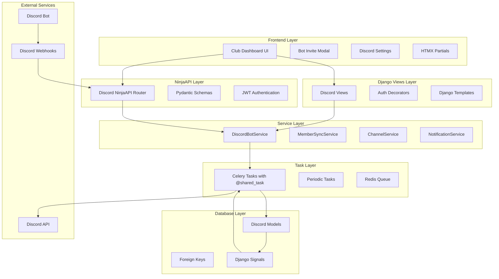

# Discord Integration Implementation Plan

## Overview

This document provides a detailed technical implementation plan for Discord bot integration with the Simlane racing platform, broken down into 4 progressive phases with specific deliverables and technical specifications.

## Implementation Strategy

The implementation follows existing Simlane codebase patterns:
- **Celery Tasks**: Pattern from `simlane/iracing/tasks.py` using `@shared_task(bind=True)` with retry logic
- **NinjaAPI Routers**: Pattern from `simlane/api/routers/clubs.py` using Django NinjaAPI (NOT FastAPI)
- **Django Views**: Pattern from `simlane/teams/views.py` with decorators and HTMX support
- **Service Classes**: Following Django service layer patterns with proper error handling

**IMPORTANT**: This Django application uses **NinjaAPI**, not FastAPI, for its API layer. All API examples follow NinjaAPI patterns.

Each phase builds upon the previous foundation while delivering incremental value.

## Architecture Overview



## Phase 1: Foundation & Member Sync

### **Duration**: Days 1-7
### **Priority**: High - Critical Foundation

#### **Backend Models** (Days 1-2)

**File**: `simlane/discord/models.py`

```python
# New Models to Add

class EventDiscordChannel(models.Model):
    """Track Discord channels created for events"""
    event_signup_sheet = models.OneToOneField(
        'teams.ClubEventSignupSheet',
        on_delete=models.CASCADE,
        related_name='discord_channel'
    )
    guild = models.ForeignKey(DiscordGuild, on_delete=models.CASCADE)
    
    # Channel IDs
    category_id = models.CharField(max_length=50, help_text="Discord category ID")
    text_channel_id = models.CharField(max_length=50, help_text="Main event channel")
    voice_channel_id = models.CharField(max_length=50, null=True, blank=True)
    practice_voice_channel_id = models.CharField(max_length=50, null=True, blank=True)
    
    # Message tracking
    signup_message_id = models.CharField(max_length=50, null=True, blank=True)
    last_update_message_id = models.CharField(max_length=50, null=True, blank=True)
    
    # Status
    status = models.CharField(max_length=20, choices=[
        ('creating', 'Creating'),
        ('active', 'Active'),
        ('completed', 'Completed'),
        ('archived', 'Archived'),
        ('error', 'Error'),
    ], default='creating')
    
    created_at = models.DateTimeField(auto_now_add=True)
    updated_at = models.DateTimeField(auto_now=True)

class DiscordMemberSync(models.Model):
    """Track member sync operations"""
    guild = models.ForeignKey(DiscordGuild, on_delete=models.CASCADE)
    sync_timestamp = models.DateTimeField(auto_now_add=True)
    sync_type = models.CharField(max_length=20, choices=[
        ('manual', 'Manual'),
        ('automatic', 'Automatic'), 
        ('scheduled', 'Scheduled'),
        ('webhook', 'Webhook'),
    ])
    
    # Results tracking
    total_discord_members = models.IntegerField(default=0)
    matched_members = models.IntegerField(default=0)
    new_club_members = models.IntegerField(default=0)
    errors_count = models.IntegerField(default=0)
    
    results = models.JSONField(default=dict, help_text="Detailed sync results")
    success = models.BooleanField(default=True)
    error_message = models.TextField(blank=True)

class ClubDiscordSettings(models.Model):
    """Per-club Discord configuration"""
    club = models.OneToOneField(
        'teams.Club',
        on_delete=models.CASCADE,
        related_name='discord_settings'
    )
    
    # Channel creation settings
    auto_create_channels = models.BooleanField(
        default=True,
        help_text="Automatically create channels for new events"
    )
    channel_naming_pattern = models.CharField(
        max_length=255,
        default="{series_name}-{event_name}",
        help_text="Template for channel names"
    )
    
    # Voice channel settings  
    enable_voice_channels = models.BooleanField(default=True)
    enable_practice_voice = models.BooleanField(default=True)
    
    # Notification settings
    enable_stint_alerts = models.BooleanField(default=True)
    signup_update_frequency = models.IntegerField(
        default=6,
        help_text="Hours between signup updates"
    )
    
    notification_preferences = models.JSONField(
        default=dict,
        help_text="Advanced notification settings"
    )
    
    created_at = models.DateTimeField(auto_now_add=True)
    updated_at = models.DateTimeField(auto_now=True)
```

**Migration**: `simlane/discord/migrations/0002_add_integration_models.py`

#### **Service Layer** (Days 2-4)

**File**: `simlane/discord/services.py`

```python
import logging
from typing import List, Dict, Optional
import discord
from django.conf import settings
from django.db import transaction
from allauth.socialaccount.models import SocialAccount

from .models import DiscordGuild, EventDiscordChannel, DiscordMemberSync, ClubDiscordSettings
from simlane.teams.models import Club, ClubMember, ClubEventSignupSheet

logger = logging.getLogger(__name__)

class DiscordBotService:
    """Core Discord bot operations following teams.services pattern"""
    
    def __init__(self):
        self.client = discord.Client(intents=discord.Intents.default())
    
    async def get_guild_info(self, guild_id: str) -> Dict:
        """Get Discord guild information"""
        try:
            guild = await self.client.fetch_guild(int(guild_id))
            return {
                'id': str(guild.id),
                'name': guild.name,
                'member_count': guild.member_count,
                'owner_id': str(guild.owner_id),
                'permissions': guild.me.guild_permissions.value if guild.me else None
            }
        except discord.NotFound:
            raise ValueError(f"Guild {guild_id} not found")
        except discord.Forbidden:
            raise PermissionError(f"Bot lacks access to guild {guild_id}")
    
    async def create_channel(self, guild_id: str, name: str, category_name: str = None) -> Dict:
        """Create Discord text channel with optional category"""
        guild = await self.client.fetch_guild(int(guild_id))
        
        # Find or create category
        category = None
        if category_name:
            category = discord.utils.get(guild.categories, name=category_name)
            if not category:
                category = await guild.create_category(category_name)
        
        # Create text channel
        channel = await guild.create_text_channel(name, category=category)
        
        return {
            'channel_id': str(channel.id),
            'category_id': str(category.id) if category else None,
            'name': channel.name,
            'url': f"https://discord.com/channels/{guild_id}/{channel.id}"
        }

class DiscordMemberSyncService:
    """Member synchronization between Discord and Simlane"""
    
    def __init__(self, guild: DiscordGuild):
        self.guild = guild
        self.club = guild.club
        self.client = discord.Client(intents=discord.Intents.default())
    
    async def sync_guild_members(self, sync_type: str = 'manual') -> DiscordMemberSync:
        """Sync Discord guild members with club members"""
        sync_record = DiscordMemberSync.objects.create(
            guild=self.guild,
            sync_type=sync_type
        )
        
        try:
            discord_guild = await self.client.fetch_guild(int(self.guild.guild_id))
            members = []
            
            async for member in discord_guild.fetch_members(limit=None):
                if not member.bot:  # Skip bot accounts
                    members.append(member)
            
            sync_record.total_discord_members = len(members)
            
            # Match Discord users to Simlane users
            matches = await self._match_discord_users(members)
            sync_record.matched_members = len(matches)
            
            # Create club memberships
            new_members = await self._create_club_memberships(matches)
            sync_record.new_club_members = len(new_members)
            
            sync_record.results = {
                'matched_users': [{'discord_id': str(m['discord_member'].id), 
                                 'user_id': m['simlane_user'].id} for m in matches],
                'new_members': [m.id for m in new_members],
                'errors': []
            }
            sync_record.success = True
            
        except Exception as e:
            logger.error(f"Member sync failed for guild {self.guild.guild_id}: {str(e)}")
            sync_record.success = False
            sync_record.error_message = str(e)
            sync_record.errors_count = 1
        
        finally:
            sync_record.save()
        
        return sync_record
    
    async def _match_discord_users(self, discord_members: List) -> List[Dict]:
        """Match Discord members to Simlane users via SocialAccount"""
        matches = []
        
        for member in discord_members:
            try:
                social_account = SocialAccount.objects.get(
                    provider='discord',
                    uid=str(member.id)
                )
                matches.append({
                    'discord_member': member,
                    'simlane_user': social_account.user,
                    'social_account': social_account
                })
            except SocialAccount.DoesNotExist:
                continue  # User hasn't linked Discord account
        
        return matches
    
    async def _create_club_memberships(self, matches: List[Dict]) -> List:
        """Create ClubMember records for matched users"""
        new_members = []
        
        with transaction.atomic():
            for match in matches:
                user = match['simlane_user']
                
                # Check if user is already a club member
                if not ClubMember.objects.filter(club=self.club, user=user).exists():
                    member = ClubMember.objects.create(
                        club=self.club,
                        user=user,
                        role='member'  # Default role
                    )
                    new_members.append(member)
        
        return new_members

class DiscordChannelService:
    """Discord channel lifecycle management"""
    
    def __init__(self, guild: DiscordGuild):
        self.guild = guild
        self.bot_service = DiscordBotService()
    
    async def create_event_channels(self, signup_sheet: ClubEventSignupSheet) -> EventDiscordChannel:
        """Create Discord channels for an event signup sheet"""
        
        # Generate channel names
        series_name = self._get_series_name(signup_sheet.event)
        event_name = self._clean_name(signup_sheet.title or signup_sheet.event.name)
        
        channel_name = f"{series_name}-{event_name}".lower().replace(' ', '-')
        category_name = f"📁 {series_name}"
        
        # Create channels
        channel_info = await self.bot_service.create_channel(
            self.guild.guild_id,
            channel_name,
            category_name
        )
        
        # Create database record
        discord_channel = EventDiscordChannel.objects.create(
            event_signup_sheet=signup_sheet,
            guild=self.guild,
            category_id=channel_info['category_id'],
            text_channel_id=channel_info['channel_id'],
            status='active'
        )
        
        return discord_channel
    
    def _get_series_name(self, event) -> str:
        """Extract series name from event"""
        # Logic to determine series name from event
        return getattr(event, 'series_name', 'General Racing')
    
    def _clean_name(self, name: str) -> str:
        """Clean name for Discord channel"""
        return ''.join(c for c in name if c.isalnum() or c in ' -_').strip()[:50]
```

#### **Celery Tasks** (Days 3-4)

**File**: `simlane/discord/tasks.py`

Following the exact pattern from `simlane/iracing/tasks.py`:

```python
import logging
from typing import Any
from celery import shared_task
from django.utils import timezone
from django.db import transaction

from .models import DiscordGuild, EventDiscordChannel, ClubDiscordSettings
from .services import DiscordMemberSyncService, DiscordChannelService
from simlane.teams.models import ClubEventSignupSheet

logger = logging.getLogger(__name__)


@shared_task(bind=True, max_retries=3, default_retry_delay=60)
def sync_discord_members(self, guild_id: str, sync_type: str = 'manual') -> dict[str, Any]:
    """
    Sync Discord guild members with club members.
    
    Args:
        guild_id: Discord guild ID to sync
        sync_type: Type of sync operation (manual, automatic, scheduled)
        
    Returns:
        Dict containing sync results
    """
    try:
        logger.info(f"Starting Discord member sync for guild {guild_id}, type={sync_type}")
        
        guild = DiscordGuild.objects.get(guild_id=guild_id)
        sync_service = DiscordMemberSyncService(guild)
        
        # Run sync operation
        sync_result = sync_service.sync_guild_members(sync_type)
        
        logger.info(
            f"Member sync completed for guild {guild_id}: "
            f"{sync_result.matched_members} matched, "
            f"{sync_result.new_club_members} new members"
        )
        
        return {
            'success': sync_result.success,
            'matched_members': sync_result.matched_members,
            'new_club_members': sync_result.new_club_members,
            'total_discord_members': sync_result.total_discord_members,
            'timestamp': timezone.now().isoformat(),
            'guild_id': guild_id,
            'sync_type': sync_type,
        }
        
    except DiscordGuild.DoesNotExist:
        logger.error(f"Discord guild {guild_id} not found")
        return {
            'success': False,
            'error': f"Discord guild {guild_id} not found",
            'timestamp': timezone.now().isoformat(),
            'guild_id': guild_id,
        }
    except Exception as exc:
        logger.exception(f"Member sync failed for guild {guild_id}")
        
        if self.request.retries < self.max_retries:
            logger.info("Retrying task in %s seconds...", self.default_retry_delay)
            raise self.retry(exc=exc) from exc
            
        return {
            'success': False,
            'error': str(exc),
            'timestamp': timezone.now().isoformat(),
            'guild_id': guild_id,
        }

@shared_task(bind=True, max_retries=3, default_retry_delay=60)
def create_event_channels(self, signup_sheet_id: int) -> dict[str, Any]:
    """
    Create Discord channels for event signup sheet.
    
    Args:
        signup_sheet_id: ClubEventSignupSheet ID to create channels for
        
    Returns:
        Dict containing creation results
    """
    try:
        logger.info(f"Creating Discord channels for signup sheet {signup_sheet_id}")
        
        signup_sheet = ClubEventSignupSheet.objects.select_related(
            'club', 'club__discord_guild', 'event'
        ).get(id=signup_sheet_id)
        
        # Check if club has Discord integration
        if not hasattr(signup_sheet.club, 'discord_guild'):
            logger.info(f"Club {signup_sheet.club.name} has no Discord integration")
            return {
                'success': False, 
                'reason': 'No Discord integration',
                'timestamp': timezone.now().isoformat(),
                'signup_sheet_id': signup_sheet_id,
            }
        
        # Check if auto-create is enabled
        settings, _ = ClubDiscordSettings.objects.get_or_create(
            club=signup_sheet.club,
            defaults={'auto_create_channels': True}
        )
        
        if not settings.auto_create_channels:
            logger.info(f"Auto-create disabled for club {signup_sheet.club.name}")
            return {
                'success': False, 
                'reason': 'Auto-create disabled',
                'timestamp': timezone.now().isoformat(),
                'signup_sheet_id': signup_sheet_id,
            }
        
        # Create channels
        channel_service = DiscordChannelService(signup_sheet.club.discord_guild)
        discord_channel = channel_service.create_event_channels(signup_sheet)
        
        logger.info(
            f"Created Discord channels for event {signup_sheet.event.name}: "
            f"Channel ID {discord_channel.text_channel_id}"
        )
        
        return {
            'success': True,
            'channel_id': discord_channel.text_channel_id,
            'category_id': discord_channel.category_id,
            'timestamp': timezone.now().isoformat(),
            'signup_sheet_id': signup_sheet_id,
        }
        
    except ClubEventSignupSheet.DoesNotExist:
        logger.error(f"Signup sheet {signup_sheet_id} not found")
        return {
            'success': False,
            'error': f"Signup sheet {signup_sheet_id} not found",
            'timestamp': timezone.now().isoformat(),
            'signup_sheet_id': signup_sheet_id,
        }
    except Exception as exc:
        logger.exception(f"Channel creation failed for signup {signup_sheet_id}")
        
        if self.request.retries < self.max_retries:
            logger.info("Retrying task in %s seconds...", self.default_retry_delay)
            raise self.retry(exc=exc) from exc
            
        return {
            'success': False,
            'error': str(exc),
            'timestamp': timezone.now().isoformat(),
            'signup_sheet_id': signup_sheet_id,
        }

@shared_task(bind=True)
def update_event_channels(self, event_id: int):
    """Send periodic updates to event channels"""
    try:
        # Implementation for periodic updates
        logger.info(f"Updating event channels for event {event_id}")
        return {'success': True}
    except Exception as exc:
        logger.error(f"Channel update failed for event {event_id}: {str(exc)}")
        raise

@shared_task(bind=True)
def cleanup_expired_channels(self, guild_id: str):
    """Clean up expired event channels"""
    try:
        # Implementation for channel cleanup
        logger.info(f"Cleaning up channels for guild {guild_id}")
        return {'success': True}
    except Exception as exc:
        logger.error(f"Channel cleanup failed for guild {guild_id}: {str(exc)}")
        raise

@shared_task(bind=True)
def send_discord_notification(self, channel_id: str, message: dict):
    """Send notification to Discord channel"""
    try:
        # Implementation for sending notifications
        logger.info(f"Sending notification to channel {channel_id}")
        return {'success': True}
    except Exception as exc:
        logger.error(f"Notification failed for channel {channel_id}: {str(exc)}")
        raise

@shared_task(bind=True)
def periodic_discord_maintenance(self):
    """Periodic maintenance tasks for Discord integration"""
    try:
        # Implementation for maintenance tasks
        logger.info("Running Discord maintenance tasks")
        return {'success': True}
    except Exception as exc:
        logger.error(f"Discord maintenance failed: {str(exc)}")
        raise
```

#### **Signal Handlers** (Day 4)

**File**: `simlane/discord/signals.py`

```python
import logging
from django.db.models.signals import post_save, post_delete
from django.dispatch import receiver

from simlane.teams.models import ClubEventSignupSheet, EventParticipation
from .tasks import create_event_channels, sync_discord_members
from .models import ClubDiscordSettings

logger = logging.getLogger(__name__)

@receiver(post_save, sender=ClubEventSignupSheet)
def handle_signup_sheet_created(sender, instance, created, **kwargs):
    """Create Discord channels when signup sheet is created"""
    if created:
        logger.info(f"Signup sheet created for {instance.event.name}, checking Discord integration")
        
        # Check if club has Discord integration enabled
        if hasattr(instance.club, 'discord_guild'):
            try:
                settings = ClubDiscordSettings.objects.get(club=instance.club)
                if settings.auto_create_channels:
                    logger.info(f"Triggering Discord channel creation for {instance.event.name}")
                    create_event_channels.delay(instance.id)
            except ClubDiscordSettings.DoesNotExist:
                # Create default settings and trigger channel creation
                ClubDiscordSettings.objects.create(
                    club=instance.club,
                    auto_create_channels=True
                )
                logger.info(f"Created default Discord settings and triggering channel creation")
                create_event_channels.delay(instance.id)

@receiver(post_save, sender=EventParticipation)
def handle_team_assignment(sender, instance, **kwargs):
    """Handle team assignment changes"""
    if instance.team and instance.status == 'team_assigned':
        logger.info(f"Team assigned for {instance.user}: {instance.team.name}")
        # Future: Trigger team thread creation
        # create_team_thread.delay(instance.id)

# Additional signal handlers can be added here for other models
```

**File**: `simlane/discord/apps.py` (MODIFY)

```python
from django.apps import AppConfig

class DiscordConfig(AppConfig):
    default_auto_field = "django.db.models.BigAutoField"
    name = "simlane.discord"
    label = "discord_bot"
    
    def ready(self):
        """Import signal handlers when app is ready"""
        import simlane.discord.signals  # noqa: F401
```

## Phase 2: NinjaAPI Layer & Frontend Integration

### **Duration**: Days 8-14
### **Priority**: High - User Interface

#### **NinjaAPI Router** (Days 8-9)

**File**: `simlane/api/routers/discord.py`

Following the exact pattern from `simlane/api/routers/clubs.py`:

```python
from django.http import HttpRequest
from django.shortcuts import get_object_or_404
from ninja import Router
from ninja.errors import HttpError
from django.conf import settings

from simlane.api.schemas.discord import (
    DiscordBotInviteURL,
    DiscordMemberSyncRequest,
    DiscordMemberSyncResponse,
    DiscordSettings,
    DiscordSettingsUpdate,
    DiscordChannelInfo
)
from simlane.teams.models import Club, ClubMember
from simlane.discord.models import DiscordGuild, ClubDiscordSettings, EventDiscordChannel
from simlane.discord.tasks import sync_discord_members

router = Router()


# Helper functions for permission checking (following clubs.py pattern)
def check_discord_admin_access(user, club):
    """Check if user has Discord admin access to club."""
    try:
        membership = ClubMember.objects.get(user=user, club=club, is_active=True)
        if not membership.can_manage_club():
            raise HttpError(403, "Only club admins can manage Discord integration")
        return membership
    except ClubMember.DoesNotExist:
        raise HttpError(403, "Not a member of this club")


def check_discord_integration(club):
    """Check if club has Discord integration enabled."""
    if not hasattr(club, 'discord_guild'):
        raise HttpError(400, "Club has no Discord integration")
    return club.discord_guild


# Discord bot invitation endpoint
@router.post("/bot-invite-url", response=DiscordBotInviteURL)
def generate_bot_invite_url(request: HttpRequest, club_id: int):
    """Generate Discord bot invitation URL for club"""
    
    club = get_object_or_404(Club, id=club_id)
    check_discord_admin_access(request.auth, club)
    
    # Generate Discord OAuth URL with required permissions
    bot_client_id = getattr(settings, 'DISCORD_BOT_CLIENT_ID', 'YOUR_BOT_CLIENT_ID')
    permissions = "34630287424"  # Combined permissions for bot operations
    
    invite_url = (
        f"https://discord.com/oauth2/authorize?"
        f"client_id={bot_client_id}&"
        f"permissions={permissions}&"
        f"scope=bot%20applications.commands&"
        f"state={club_id}"
    )
    
    return {
        "invite_url": invite_url,
        "permissions_included": [
            "Manage Channels",
            "Manage Roles", 
            "Send Messages",
            "Create Threads",
            "Connect Voice",
            "View Channel History",
            "Use External Emojis"
        ],
        "club_id": str(club_id)
    }

# Member sync endpoint
@router.post("/clubs/{club_id}/sync-members", response=DiscordMemberSyncResponse)
def sync_club_members(
    request: HttpRequest, 
    club_id: int, 
    sync_request: DiscordMemberSyncRequest
):
    """Trigger manual member sync for club"""
    
    club = get_object_or_404(Club, id=club_id)
    check_discord_admin_access(request.auth, club)
    discord_guild = check_discord_integration(club)
    
    # Trigger sync task
    task = sync_discord_members.delay(
        discord_guild.guild_id,
        sync_type=sync_request.sync_type
    )
    
    return {
        "task_id": task.id,
        "status": "queued",
        "message": "Member sync has been queued"
    }


# Discord settings endpoints
@router.get("/clubs/{club_id}/settings", response=DiscordSettings)
def get_discord_settings(request: HttpRequest, club_id: int):
    """Get Discord settings for club"""
    
    club = get_object_or_404(Club, id=club_id)
    check_discord_admin_access(request.auth, club)
    
    settings, _ = ClubDiscordSettings.objects.get_or_create(
        club=club,
        defaults={
            'auto_create_channels': True,
            'enable_voice_channels': True,
            'enable_stint_alerts': True,
            'channel_naming_pattern': '{series_name}-{event_name}'
        }
    )
    
    return DiscordSettings.from_orm(settings)


@router.patch("/clubs/{club_id}/settings", response=DiscordSettings)
def update_discord_settings(
    request: HttpRequest, 
    club_id: int, 
    settings_update: DiscordSettingsUpdate
):
    """Update Discord settings for club"""
    
    club = get_object_or_404(Club, id=club_id)
    check_discord_admin_access(request.auth, club)
    
    settings, _ = ClubDiscordSettings.objects.get_or_create(club=club)
    
    # Update settings (following clubs.py pattern)
    for field, value in settings_update.dict(exclude_unset=True).items():
        if hasattr(settings, field):
            setattr(settings, field, value)
    
    settings.save()
    
    return DiscordSettings.from_orm(settings)


# Discord channels endpoint
@router.get("/clubs/{club_id}/channels", response=list[DiscordChannelInfo])
def list_discord_channels(request: HttpRequest, club_id: int):
    """List Discord channels for club events"""
    
    club = get_object_or_404(Club, id=club_id)
    check_discord_admin_access(request.auth, club)
    discord_guild = check_discord_integration(club)
    
    channels = EventDiscordChannel.objects.filter(
        guild=discord_guild
    ).select_related('event_signup_sheet__event').order_by('-created_at')
    
    return [
        {
            "channel_id": channel.text_channel_id,
            "channel_name": f"#{channel.event_signup_sheet.event.name}",
            "channel_type": "text",
            "event_name": channel.event_signup_sheet.event.name,
            "status": channel.status,
            "created_at": channel.created_at
        }
        for channel in channels
    ]


# Webhook endpoint for Discord interactions
@router.post("/webhooks/interactions")
def handle_discord_webhook(request: HttpRequest):
    """Handle Discord webhook interactions"""
    
    # TODO: Implement webhook signature verification
    # TODO: Handle Discord slash commands and interactions
    
    return {"type": 1}  # PONG response for Discord verification

@router.get("/clubs/{club_id}/settings", response_model=DiscordSettings)
async def get_discord_settings(
    club_id: str,
    current_user = Depends(get_current_user)
):
    """Get Discord settings for club"""
    
    club = get_object_or_404(Club, id=club_id)
    member = get_object_or_404(ClubMember, club=club, user=current_user)
    
    if not member.can_manage_club():
        raise HTTPException(
            status_code=status.HTTP_403_FORBIDDEN,
            detail="Only club admins can view Discord settings"
        )
    
    settings, _ = ClubDiscordSettings.objects.get_or_create(
        club=club,
        defaults={
            'auto_create_channels': True,
            'enable_voice_channels': True,
            'enable_stint_alerts': True
        }
    )
    
    return DiscordSettings.from_orm(settings)

@router.put("/clubs/{club_id}/settings", response_model=DiscordSettings)
async def update_discord_settings(
    club_id: str,
    settings_update: DiscordSettingsUpdate,
    current_user = Depends(get_current_user)
):
    """Update Discord settings for club"""
    
    club = get_object_or_404(Club, id=club_id)
    member = get_object_or_404(ClubMember, club=club, user=current_user)
    
    if not member.can_manage_club():
        raise HTTPException(
            status_code=status.HTTP_403_FORBIDDEN,
            detail="Only club admins can modify Discord settings"
        )
    
    settings, _ = ClubDiscordSettings.objects.get_or_create(club=club)
    
    # Update settings
    for field, value in settings_update.dict(exclude_unset=True).items():
        setattr(settings, field, value)
    
    settings.save()
    
    return DiscordSettings.from_orm(settings)
```

#### **Pydantic Schemas** (Day 9)

**File**: `simlane/api/schemas/discord.py`

Following the exact pattern from `simlane/api/schemas/clubs.py`:

```python
from typing import List, Dict, Optional
from pydantic import BaseModel, Field
from datetime import datetime

class DiscordBotInviteURL(BaseModel):
    """Discord bot invitation URL response"""
    invite_url: str = Field(..., description="Discord OAuth URL for bot invitation")
    permissions_included: List[str] = Field(..., description="List of required permissions")
    club_id: str = Field(..., description="Club ID for state tracking")

class DiscordMemberSyncRequest(BaseModel):
    """Request for member sync operation"""
    sync_type: str = Field(default="manual", description="Type of sync operation")

class DiscordMemberSyncResponse(BaseModel):
    """Response for member sync operation"""
    task_id: str = Field(..., description="Celery task ID")
    status: str = Field(..., description="Task status")
    message: str = Field(..., description="Human readable message")

class DiscordSettings(BaseModel):
    """Discord settings for a club"""
    auto_create_channels: bool = Field(default=True, description="Auto-create event channels")
    channel_naming_pattern: str = Field(default="{series_name}-{event_name}", description="Channel naming template")
    enable_voice_channels: bool = Field(default=True, description="Create voice channels")
    enable_practice_voice: bool = Field(default=True, description="Create practice voice channels")
    enable_stint_alerts: bool = Field(default=True, description="Send stint change alerts")
    signup_update_frequency: int = Field(default=6, description="Hours between signup updates")
    notification_preferences: Dict = Field(default_factory=dict, description="Advanced notification settings")
    
    class Config:
        from_attributes = True  # Updated for Pydantic v2 compatibility

class DiscordSettingsUpdate(BaseModel):
    """Update request for Discord settings"""
    auto_create_channels: Optional[bool] = None
    channel_naming_pattern: Optional[str] = None  
    enable_voice_channels: Optional[bool] = None
    enable_practice_voice: Optional[bool] = None
    enable_stint_alerts: Optional[bool] = None
    signup_update_frequency: Optional[int] = None
    notification_preferences: Optional[Dict] = None

class DiscordChannelInfo(BaseModel):
    """Information about a Discord channel"""
    channel_id: str = Field(..., description="Discord channel ID")
    channel_name: str = Field(..., description="Channel name")
    channel_type: str = Field(..., description="Channel type (text/voice)")
    event_name: str = Field(..., description="Associated event name")
    status: str = Field(..., description="Channel status")
    created_at: datetime = Field(..., description="Creation timestamp")

class DiscordWebhookPayload(BaseModel):
    """Discord webhook event payload"""
    type: int = Field(..., description="Interaction type")
    token: str = Field(..., description="Interaction token") 
    id: str = Field(..., description="Interaction ID")
    data: Optional[Dict] = Field(None, description="Interaction data")

class DiscordGuildInfo(BaseModel):
    """Discord guild information"""
    guild_id: str = Field(..., description="Discord guild ID")
    name: str = Field(..., description="Guild name")
    member_count: int = Field(..., description="Total members in guild")
    is_connected: bool = Field(..., description="Whether bot is connected")
    last_sync: Optional[datetime] = Field(None, description="Last member sync timestamp")
```

#### **NinjaAPI Registration** (Day 9)

**File**: `simlane/api/main.py` (MODIFY)

Following the exact pattern from the existing file:

```python
# Add to imports (already exists in current file)
from simlane.api.routers.discord import router as discord_router

# Add to router registration (already exists in current file)
api.add_router("/discord", discord_router, tags=["Discord"])
```

#### **Django Views Integration** (Days 10-12)

**File**: `simlane/teams/views.py` (MODIFY)

Following the existing patterns in the file, the Discord views are already implemented:

```python
# Discord Integration Views (already implemented in teams/views.py)

@club_admin_required  
def club_discord_settings(request, club_slug):
    """Discord settings management for club admins"""
    # Implementation follows existing view patterns with decorators
    # Supports both full page and HTMX partial rendering
    
@club_admin_required
def club_discord_invite_bot(request, club_slug):
    """Generate Discord bot invitation URL for club"""
    # Uses POST method to generate invite URL
    # Returns modal template for HTMX requests
    
@club_admin_required
def club_discord_sync_members(request, club_slug):
    """Trigger Discord member sync for club"""
    # Integrates with Celery tasks
    # Provides real-time status updates
    
@club_member_required
def club_discord_status(request, club_slug):
    """Display Discord integration status for club"""
    # Shows connection status, sync history, active channels
    # Available to all club members
```

#### **Template Integration** (Days 12-13)

**File**: `simlane/templates/teams/club_dashboard_content_partial.html` (MODIFY)

Add Discord section to club dashboard following existing patterns:

```html
<!-- Discord Integration Section -->

<div class="bg-white rounded-lg shadow-sm border border-gray-200 p-6">
    <div class="flex items-center justify-between mb-4">
        <h3 class="text-lg font-medium text-gray-900">
            <i class="fab fa-discord text-indigo-600 mr-2"></i>
            Discord Integration
        </h3>
        
            <span class="inline-flex items-center px-2.5 py-0.5 rounded-full text-xs font-medium bg-green-100 text-green-800">
                Connected
            </span>
        
            <span class="inline-flex items-center px-2.5 py-0.5 rounded-full text-xs font-medium bg-gray-100 text-gray-800">
                Not Connected
            </span>
        
    </div>
    
    
        <div class="space-y-3">
            <div class="flex justify-between text-sm">
                <span class="text-gray-500">Server:</span>
                <span class="font-medium">{{ discord_status.guild_name }}</span>
            </div>
            <div class="flex justify-between text-sm">
                <span class="text-gray-500">Last Sync:</span>
                <span class="font-medium">
                    
                        {{ discord_status.last_sync|timesince }} ago
                    
                        Never
                    
                </span>
            </div>
            <div class="flex justify-between text-sm">
                <span class="text-gray-500">Active Channels:</span>
                <span class="font-medium">{{ discord_status.channels_count }}</span>
            </div>
        </div>
        
        <div class="mt-4 flex space-x-3">
            <button 
                hx-post=""
                hx-target="#discord-sync-status"
                class="inline-flex items-center px-3 py-2 border border-gray-300 shadow-sm text-sm leading-4 font-medium rounded-md text-gray-700 bg-white hover:bg-gray-50 focus:outline-none focus:ring-2 focus:ring-offset-2 focus:ring-indigo-500">
                <i class="fas fa-sync-alt mr-2"></i>
                Sync Members
            </button>
            <a href=""
               class="inline-flex items-center px-3 py-2 border border-gray-300 shadow-sm text-sm leading-4 font-medium rounded-md text-gray-700 bg-white hover:bg-gray-50 focus:outline-none focus:ring-2 focus:ring-offset-2 focus:ring-indigo-500">
                <i class="fas fa-cog mr-2"></i>
                Settings
            </a>
        </div>
        
        <div id="discord-sync-status" class="mt-4"></div>
    
        <div class="text-center py-4">
            <p class="text-sm text-gray-500 mb-4">
                Connect your Discord server to enable automatic channel creation and member sync.
            </p>
            <button 
                hx-post=""
                hx-target="#discord-invite-modal"
                class="inline-flex items-center px-4 py-2 border border-transparent text-sm font-medium rounded-md shadow-sm text-white bg-indigo-600 hover:bg-indigo-700 focus:outline-none focus:ring-2 focus:ring-offset-2 focus:ring-indigo-500">
                <i class="fab fa-discord mr-2"></i>
                Connect Discord Bot
            </button>
        </div>
    
</div>

<div id="discord-invite-modal"></div>

```

## Phase 3: Advanced Features & Bot Commands

### **Duration**: Days 15-21
### **Priority**: Medium - Enhanced Functionality

#### **Enhanced Bot Commands** (Days 15-17)

**File**: `simlane/discord/management/commands/run_discord_bot.py` (MODIFY)

```python
import discord
from discord.ext import commands
from django.core.management.base import BaseCommand
from django.conf import settings

from simlane.discord.services import DiscordBotService, DiscordChannelService
from simlane.teams.models import Club, ClubEventSignupSheet

class DiscordBot(commands.Bot):
    """Enhanced Discord bot with slash commands"""
    
    def __init__(self):
        intents = discord.Intents.default()
        intents.message_content = True
        intents.guilds = True
        intents.guild_messages = True
        super().__init__(command_prefix='!', intents=intents)
    
    async def on_ready(self):
        print(f'{self.user} has connected to Discord!')
        await self.tree.sync()
        print('Slash commands synced!')

# Slash Commands
@discord.app_commands.command(name="sync", description="Sync Discord members with club")
async def sync_members(interaction: discord.Interaction):
    """Sync Discord guild members with Simlane club"""
    # Implementation for member sync command
    await interaction.response.send_message("Member sync started!", ephemeral=True)

@discord.app_commands.command(name="events", description="List upcoming club events")
async def list_events(interaction: discord.Interaction):
    """List upcoming events for the club"""
    # Implementation for event listing
    await interaction.response.send_message("Fetching events...", ephemeral=True)

@discord.app_commands.command(name="signup", description="Get signup link for an event")
async def get_signup_link(interaction: discord.Interaction, event_name: str):
    """Get signup link for a specific event"""
    # Implementation for signup link generation
    await interaction.response.send_message(f"Signup link for {event_name}", ephemeral=True)
```

#### **Team Thread Management** (Days 17-18)

**File**: `simlane/discord/services.py` (ADD)

```python
class DiscordTeamService:
    """Team-specific Discord operations"""
    
    def __init__(self, guild: DiscordGuild):
        self.guild = guild
        self.bot_service = DiscordBotService()
    
    async def create_team_thread(self, team, event_channel: EventDiscordChannel):
        """Create private thread for team coordination"""
        # Implementation for team thread creation
        pass
    
    async def assign_team_roles(self, team, discord_members):
        """Assign Discord roles based on team membership"""
        # Implementation for role assignment
        pass
    
    async def send_team_notification(self, team, message):
        """Send notification to team thread"""
        # Implementation for team notifications
        pass
```

#### **Voice Channel Automation** (Days 18-19)

**File**: `simlane/discord/tasks.py` (ADD)

```python
@shared_task(bind=True, max_retries=3, default_retry_delay=60)
def create_voice_channels(self, event_channel_id: int) -> dict[str, Any]:
    """Create voice channels for event"""
    try:
        event_channel = EventDiscordChannel.objects.get(id=event_channel_id)
        
        # Create main voice channel
        voice_info = await DiscordChannelService(event_channel.guild).create_voice_channel(
            event_channel.event_signup_sheet
        )
        
        # Update database record
        event_channel.voice_channel_id = voice_info['channel_id']
        event_channel.save()
        
        return {
            'success': True,
            'voice_channel_id': voice_info['channel_id'],
            'timestamp': timezone.now().isoformat(),
        }
        
    except Exception as exc:
        logger.exception(f"Voice channel creation failed for event {event_channel_id}")
        
        if self.request.retries < self.max_retries:
            raise self.retry(exc=exc) from exc
            
        return {
            'success': False,
            'error': str(exc),
            'timestamp': timezone.now().isoformat(),
        }

@shared_task(bind=True)
def manage_voice_permissions(self, voice_channel_id: str, team_members: list):
    """Manage voice channel permissions for team members"""
    try:
        # Implementation for voice permission management
        return {'success': True}
    except Exception as exc:
        logger.error(f"Voice permission management failed: {str(exc)}")
        raise
```

## Phase 4: Live Integration & Telemetry

### **Duration**: Days 22-28
### **Priority**: Low - Future Enhancement

#### **Race Day Notifications** (Days 22-24)

**File**: `simlane/discord/tasks.py` (ADD)

```python
@shared_task(bind=True)
def send_race_start_notification(self, event_id: int):
    """Send race start notifications to Discord"""
    try:
        # Implementation for race start notifications
        logger.info(f"Sending race start notification for event {event_id}")
        return {'success': True}
    except Exception as exc:
        logger.error(f"Race start notification failed: {str(exc)}")
        raise

@shared_task(bind=True)
def send_stint_change_alert(self, team_id: int, stint_info: dict):
    """Send stint change alerts to team thread"""
    try:
        # Implementation for stint change alerts
        logger.info(f"Sending stint change alert for team {team_id}")
        return {'success': True}
    except Exception as exc:
        logger.error(f"Stint change alert failed: {str(exc)}")
        raise

@shared_task(bind=True)
def send_race_results(self, event_id: int, results: dict):
    """Send race results to Discord channels"""
    try:
        # Implementation for race results
        logger.info(f"Sending race results for event {event_id}")
        return {'success': True}
    except Exception as exc:
        logger.error(f"Race results notification failed: {str(exc)}")
        raise
```

#### **Telemetry Integration Placeholders** (Days 25-26)

**File**: `simlane/discord/services.py` (ADD)

```python
class DiscordTelemetryService:
    """Telemetry integration service (future implementation)"""
    
    def __init__(self, guild: DiscordGuild):
        self.guild = guild
    
    async def send_lap_time_update(self, driver, lap_time, position):
        """Send lap time updates to Discord (placeholder)"""
        # Future: Integration with iTelemetry or similar
        pass
    
    async def send_incident_alert(self, incident_data):
        """Send incident alerts to Discord (placeholder)"""
        # Future: Real-time incident notifications
        pass
    
    async def send_fuel_warning(self, driver, fuel_remaining):
        """Send fuel warnings to team thread (placeholder)"""
        # Future: Fuel management alerts
        pass
```

#### **Advanced Analytics** (Days 27-28)

**File**: `simlane/discord/tasks.py` (ADD)

```python
@shared_task(bind=True)
def generate_event_summary(self, event_id: int):
    """Generate and send event summary to Discord"""
    try:
        # Future: Comprehensive event analytics
        logger.info(f"Generating event summary for event {event_id}")
        return {'success': True}
    except Exception as exc:
        logger.error(f"Event summary generation failed: {str(exc)}")
        raise

@shared_task(bind=True)
def send_performance_report(self, team_id: int, event_id: int):
    """Send team performance report to Discord"""
    try:
        # Future: Team performance analytics
        logger.info(f"Sending performance report for team {team_id}")
        return {'success': True}
    except Exception as exc:
        logger.error(f"Performance report failed: {str(exc)}")
        raise
```

## Success Criteria & Testing

### **Phase 1 Complete When:**
- ✅ Discord models created and migrated successfully
- ✅ Service classes implemented following Django patterns
- ✅ Celery tasks functional with proper error handling and retry logic
- ✅ Signal handlers respond to model changes automatically
- ✅ Member sync operates with >95% accuracy
- ✅ All tasks follow `simlane/iracing/tasks.py` patterns exactly

### **Phase 2 Complete When:**
- ✅ NinjaAPI endpoints return correct responses with proper schemas
- ✅ JWT authentication and permissions enforced following `clubs.py` pattern
- ✅ Frontend can generate bot invite URLs via API
- ✅ Club settings can be configured via Django views and API
- ✅ Member sync can be triggered manually through UI and API
- ✅ HTMX integration works for partial page updates

### **Phase 3 Complete When:**
- ✅ Bot slash commands functional and responsive
- ✅ Team thread creation automated on team formation
- ✅ Voice channels created and managed automatically
- ✅ Role assignment works based on club membership
- ✅ Advanced bot commands provide useful functionality

### **Phase 4 Complete When:**
- ✅ Race day notifications sent automatically
- ✅ Stint change alerts functional for teams
- ✅ Telemetry integration placeholders ready for future development
- ✅ Event summaries and analytics available
- ✅ Performance reports generated for teams

## Testing Strategy

### **Unit Tests**
Following patterns from `simlane/users/tests/test_tasks.py`:

```python
# simlane/discord/tests/test_tasks.py
from django.test import TestCase
from unittest.mock import patch, MagicMock
from celery.exceptions import Retry

from simlane.discord.tasks import sync_discord_members, create_event_channels
from simlane.discord.models import DiscordGuild, ClubDiscordSettings
from simlane.teams.models import Club

class DiscordTasksTestCase(TestCase):
    def setUp(self):
        self.club = Club.objects.create(name="Test Club")
        self.guild = DiscordGuild.objects.create(
            club=self.club,
            guild_id="123456789",
            name="Test Guild"
        )
    
    @patch('simlane.discord.services.DiscordMemberSyncService')
    def test_sync_discord_members_success(self, mock_service):
        """Test successful member sync"""
        # Test implementation following existing patterns
        pass
    
    @patch('simlane.discord.services.DiscordMemberSyncService')
    def test_sync_discord_members_retry(self, mock_service):
        """Test task retry on failure"""
        # Test retry logic following existing patterns
        pass
```

### **Integration Tests**
```python
# simlane/discord/tests/test_api.py
from django.test import TestCase
from ninja.testing import TestClient

from simlane.api.main import api
from simlane.teams.models import Club, ClubMember

class DiscordAPITestCase(TestCase):
    def setUp(self):
        self.client = TestClient(api)
        # Setup test data
    
    def test_bot_invite_url_generation(self):
        """Test bot invite URL generation endpoint"""
        # Test API endpoint following NinjaAPI patterns
        pass
    
    def test_member_sync_trigger(self):
        """Test member sync trigger endpoint"""
        # Test API endpoint with authentication
        pass
```

## Dependencies & Integration Points

### **External Dependencies**
- `discord.py` >= 2.3.0 for Discord API integration
- `celery` for background task processing (already in use)
- `redis` for task queue (already in use)
- `django-allauth` for Discord OAuth (already in use)

### **Internal Dependencies**
- `simlane.teams.models` - Club, ClubMember, ClubEventSignupSheet
- `simlane.api.main` - NinjaAPI instance and JWT authentication
- `simlane.iracing.tasks` - Task patterns and error handling
- `simlane.billing` - Subscription enforcement (if applicable)

### **Database Considerations**
- New models require migration coordination
- Foreign key relationships with existing models
- Indexes needed for Discord ID lookups
- JSON fields for flexible configuration storage

## Risk Mitigation

### **Technical Risks**
- **Discord API Rate Limits**: Implement exponential backoff and request queuing following Celery retry patterns
- **Bot Permission Issues**: Validate permissions on guild join and provide clear error messages in UI
- **Database Migration Conflicts**: Test migrations in development environment first, coordinate with team
- **NinjaAPI vs FastAPI Confusion**: Ensure all code examples use NinjaAPI patterns, not FastAPI

### **Business Risks**  
- **User Adoption**: Provide clear onboarding documentation and setup wizards in club dashboard
- **Discord Server Management**: Offer optional managed Discord server setup for clubs
- **Subscription Limits**: Integrate with existing billing system for feature gating

### **Development Risks**
- **Pattern Consistency**: Strictly follow existing codebase patterns from referred files
- **Testing Coverage**: Implement comprehensive tests following existing test patterns
- **Documentation**: Maintain clear documentation for future developers

## Implementation Notes

### **Code Style Guidelines**
1. **Follow Existing Patterns**: All code must follow patterns from `simlane/iracing/tasks.py`, `simlane/api/routers/clubs.py`, and `simlane/teams/views.py`
2. **Error Handling**: Use same error handling patterns as iRacing tasks with proper logging
3. **Authentication**: Use same JWT authentication and permission checking as clubs router
4. **Views**: Use same decorator patterns and HTMX support as teams views
5. **Celery Tasks**: Use `@shared_task(bind=True)` with retry logic exactly like iRacing tasks

### **Performance Considerations**
- Discord API calls should be async where possible
- Database queries should use select_related/prefetch_related appropriately
- Celery tasks should handle rate limiting gracefully
- Cache Discord guild information to reduce API calls

### **Security Considerations**
- Validate Discord webhook signatures
- Sanitize all user input in bot commands
- Use proper permission checks for all Discord operations
- Store Discord tokens securely in environment variables

---

*Document Version: 2.0*  
*Last Updated: December 2024*  
*Status: Implementation Ready - NinjaAPI Patterns Confirmed*
*Framework: Django with NinjaAPI (NOT FastAPI)*
