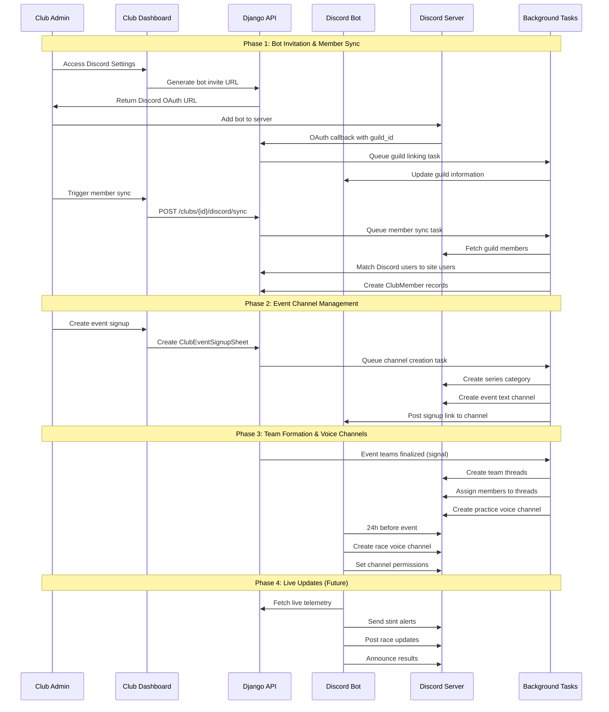

# Discord Bot Integration Plan - FINAL IMPLEMENTATION PLAN

## Project Overview

The Discord bot integration provides seamless connectivity between Simlane racing clubs and their Discord servers, automating event management, team coordination, and member communication throughout the racing workflow.

## Analysis & Approach

### **Comprehensive Codebase Analysis**
After thorough exploration of the existing codebase, the following foundation exists:
- ✅ Discord OAuth authentication via allauth (users can login/link accounts)
- ✅ Basic Discord bot infrastructure with models and Docker service
- ✅ Well-structured club dashboard with modular settings panels
- ✅ Robust Celery task system for background operations
- ✅ Established API patterns with routers and schemas
- ✅ Comprehensive testing framework with patterns to follow

### **Implementation Strategy**
The implementation follows a **4-phase approach** building upon existing codebase patterns:
1. **Phase 1**: Foundation - Bot invitation flow and member sync
2. **Phase 2**: Event Integration - Channel management and workflows  
3. **Phase 3**: Advanced Features - Team formation and voice channels
4. **Phase 4**: Future Integration - Live telemetry and race management

Each phase delivers incremental value while maintaining system stability and following established Django/Discord.py patterns.

## Implementation Architecture



## Current Implementation Status

### ✅ **COMPLETED FOUNDATION**
- **Discord Django App**: `simlane.discord` with core models
- **Social Authentication**: Discord OAuth via allauth
- **Basic Bot Commands**: ping, info, help, club, link
- **Docker Integration**: Production bot service configured
- **Database Models**: DiscordGuild, BotCommand, BotSettings

### **EXISTING MODELS & INFRASTRUCTURE**
```python
# Current Models (simlane/discord/models.py)
DiscordGuild -> OneToOne with teams.Club
BotCommand -> Command execution logging  
BotSettings -> Global bot configuration

# Integration Points
teams.Club -> discord_guild relationship
allauth.SocialAccount -> Discord user linking
teams.ClubEventSignupSheet -> Signal trigger points
teams.EventParticipation -> Team assignment triggers
```

## PHASE 1: Foundation & Member Sync Implementation

### **New Models Required**
```python
# simlane/discord/models.py additions
class EventDiscordChannel(models.Model):
    """Track Discord channels created for events"""
    event_signup_sheet = models.OneToOneField(ClubEventSignupSheet)
    category_id = models.CharField(max_length=50)
    text_channel_id = models.CharField(max_length=50)
    voice_channel_id = models.CharField(max_length=50, null=True)
    practice_voice_channel_id = models.CharField(max_length=50, null=True)
    signup_message_id = models.CharField(max_length=50, null=True)
    status = models.CharField(choices=[...])

class DiscordMemberSync(models.Model):
    """Track member sync operations"""
    guild = models.ForeignKey(DiscordGuild)
    sync_timestamp = models.DateTimeField()
    sync_type = models.CharField(choices=[...])
    results = models.JSONField()

class ClubDiscordSettings(models.Model):
    """Per-club Discord configuration"""
    club = models.OneToOneField(Club)
    auto_create_channels = models.BooleanField(default=True)
    channel_naming_pattern = models.CharField(max_length=255)
    notification_preferences = models.JSONField()
```

### **Service Layer Implementation**
```python
# simlane/discord/services.py
class DiscordBotService:
    """Core bot operations"""
    def get_guild_info(self, guild_id: str)
    def create_channel(self, guild_id: str, name: str, category: str)
    def sync_members(self, guild_id: str)

class DiscordMemberSyncService:
    """Member synchronization"""
    def sync_guild_members(self, guild: DiscordGuild)
    def match_discord_users(self, discord_members: List)
    def create_club_memberships(self, matches: List)

class DiscordChannelService:
    """Channel lifecycle management"""
    def create_event_channels(self, signup_sheet: ClubEventSignupSheet)
    def organize_by_series(self, channels: List)
    def cleanup_expired_channels(self, guild: DiscordGuild)
```

## PHASE 2: Event Channel Management

### **Signal Integration**
```python
# simlane/discord/signals.py
@receiver(post_save, sender=ClubEventSignupSheet)
def handle_signup_sheet_created(sender, instance, created, **kwargs):
    if created and instance.club.discord_integration_enabled:
        create_event_channels.delay(instance.id)

@receiver(post_save, sender=EventParticipation) 
def handle_team_assignment(sender, instance, **kwargs):
    if instance.team and instance.status == 'team_assigned':
        create_team_thread.delay(instance.id)
```

### **Celery Task Implementation**
```python
# simlane/discord/tasks.py
@shared_task(bind=True)
def create_event_channels(self, signup_sheet_id):
    """Create Discord channels for event signup"""
    
@shared_task(bind=True)
def sync_discord_members(self, guild_id):
    """Sync Discord guild members with club members"""
    
@shared_task(bind=True)
def update_event_channels(self, event_id):
    """Send periodic updates to event channels"""
```

## PHASE 3: Team Formation & Voice Management

### **Advanced Discord Integration**
```python
# Enhanced bot commands and thread management
class AdvancedDiscordFeatures:
    def create_team_threads(self, event_channel: EventDiscordChannel)
    def assign_team_roles(self, team: Team, discord_guild: DiscordGuild)
    def create_voice_channels(self, event: Event, access_type: str)
    def schedule_stint_alerts(self, stint_plan: StintPlan)
```

## PHASE 4: Live Race Management

### **Future Integration Points**
```python
# Placeholder for iTelemetry integration
class LiveRaceIntegration:
    def handle_telemetry_webhook(self, race_data: dict)
    def send_stint_alerts(self, driver_id: str, stint_time: datetime)
    def post_live_updates(self, race_status: dict)
    def announce_results(self, race_results: dict)
```

## File Implementation Plan

### **DOCUMENTATION** 🔴
- `docs/discord/DISCORD_INTEGRATION_REQUIREMENTS.md` (NEW)
- `docs/discord/IMPLEMENTATION_PLAN.md` (NEW) 
- `docs/discord/PROGRESS_TRACKER.md` (NEW)

### **BACKEND MODELS & SERVICES** 🔴
- `simlane/discord/models.py` (MODIFY) - Add integration models
- `simlane/discord/services.py` (NEW) - Discord service classes
- `simlane/discord/tasks.py` (NEW) - Celery background tasks
- `simlane/discord/signals.py` (NEW) - Django signal handlers
- `simlane/discord/apps.py` (MODIFY) - Signal registration
- `simlane/discord/admin.py` (MODIFY) - Admin interface
- `simlane/discord/migrations/0002_add_integration_models.py` (NEW)

### **API LAYER** 🔴
- `simlane/api/routers/discord.py` (NEW) - Discord API endpoints
- `simlane/api/schemas/discord.py` (NEW) - Pydantic schemas
- `simlane/api/main.py` (MODIFY) - Register Discord router

### **FRONTEND & TEMPLATES** 🔴
- `simlane/teams/views.py` (MODIFY) - Discord dashboard views
- `simlane/teams/urls.py` (MODIFY) - Discord URL patterns
- `simlane/templates/teams/club_dashboard_content_partial.html` (MODIFY)
- `simlane/templates/teams/discord/` (NEW) - Discord templates directory
- `simlane/templates/teams/discord/discord_settings.html` (NEW)
- `simlane/templates/teams/discord/bot_invite_modal.html` (NEW)
- `simlane/templates/teams/discord/member_sync_status.html` (NEW)

### **BOT ENHANCEMENT** 🔴
- `simlane/discord/management/commands/run_discord_bot.py` (MODIFY)

### **INFRASTRUCTURE** 🔴
- `docker-compose.full.yml` (MODIFY) - Add Discord bot service
- `requirements/base.txt` (MODIFY) - Additional dependencies

### **TESTING** 🔴
- `simlane/discord/tests/` (NEW) - Test directory
- `simlane/discord/tests/test_services.py` (NEW)
- `simlane/discord/tests/test_tasks.py` (NEW)
- `simlane/discord/tests/test_api.py` (NEW)
- `simlane/discord/tests/test_bot.py` (NEW)

## Progress Tracking

### **IMPLEMENTATION STATUS**
| Component | Status | Phase | Priority |
|-----------|--------|-------|----------|
| Documentation | 🔴 Not Started | 1 | High |
| Enhanced Models | 🔴 Not Started | 1 | High |
| Service Classes | 🔴 Not Started | 1 | High |
| Celery Tasks | 🔴 Not Started | 1 | High |
| API Endpoints | 🔴 Not Started | 1 | High |
| Frontend Views | 🔴 Not Started | 1 | High |
| Bot Commands | 🔴 Not Started | 1 | High |
| Signal Handlers | 🔴 Not Started | 2 | Medium |
| Channel Management | 🔴 Not Started | 2 | Medium |
| Team Features | 🔴 Not Started | 3 | Medium |
| Voice Channels | 🔴 Not Started | 3 | Medium |
| Live Integration | 🔴 Not Started | 4 | Low |
| Testing Suite | 🔴 Not Started | All | High |

### **SUCCESS CRITERIA**
- ✅ Bot successfully joins Discord servers via OAuth
- ✅ Member sync accuracy >95% with conflict resolution
- ✅ Event channels auto-created with proper organization
- ✅ Team formation creates threads and roles automatically
- ✅ Voice channels managed for practice and race sessions
- ✅ Comprehensive test coverage >90%

## Technical Requirements

### **Discord Bot Permissions**
- Manage Channels (create/edit/delete)
- Manage Roles (team assignments)
- Send Messages (notifications)
- Create Threads (team communication)
- Connect/Speak Voice (voice management)
- View Channel History (context)

### **Integration Dependencies**
- Django 4.x with allauth social
- Discord.py 2.x with application commands
- Celery with Redis backend
- PostgreSQL with proper indexing
- Docker containers for bot service

### **Security Considerations**
- Bot token secure storage (Django settings)
- Discord webhook signature verification
- User permission validation for admin operations
- Rate limiting for Discord API calls
- Graceful error handling and retry logic

## Next Steps - Implementation Order

1. **📝 Create Documentation** (Days 1-2)
   - Requirements specification
   - Implementation plan details
   - Progress tracking setup

2. **🏗️ Backend Foundation** (Days 3-7)
   - Enhanced models and migrations
   - Service classes implementation
   - Celery task infrastructure

3. **🔗 API Integration** (Days 8-10)
   - Discord API endpoints
   - Pydantic schemas
   - Router registration

4. **🎨 Frontend Development** (Days 11-14)
   - Club dashboard Discord section
   - Settings and management UI
   - Bot invitation flow

5. **🤖 Bot Enhancement** (Days 15-17)
   - Advanced command system
   - Event handling integration
   - Signal-based automation

6. **🧪 Testing & Validation** (Days 18-20)
   - Comprehensive test suite
   - Integration testing
   - Performance validation

7. **🚀 Deployment & Monitoring** (Days 21+)
   - Production deployment
   - Monitoring setup
   - Documentation finalization

---

*Last Updated: December 2024*  
*Status: Ready for Implementation - Phase 1 Priority*  
*Implementation Target: 20-day sprint with 4 progressive phases* 